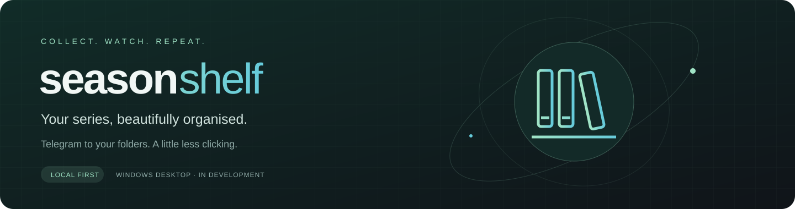
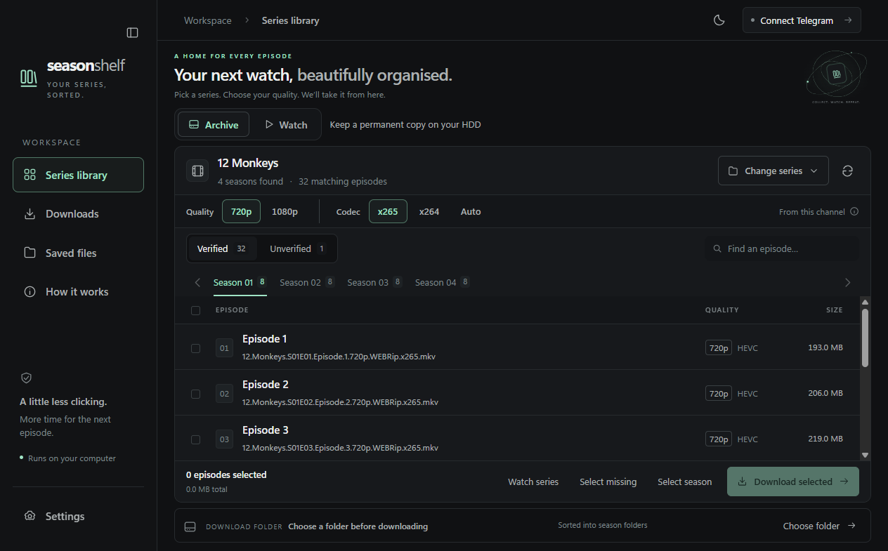

<p align="center"></p>

<p align="center">
  <a href="https://github.com/Harshana-Rathnayaka/season-shelf/actions/workflows/ci.yml"></a>
  
  
</p>

<p align="center"><a href="#get-started">Get started</a> &middot; <a href="docs/README.md">Documentation</a> &middot; <a href="docs/ROADMAP.md">Roadmap</a> &middot; <a href="CONTRIBUTING.md">Contribute</a></p>

**Download episodes from Telegram and organise them into season folders.** Choose a series, pick your quality and manage your collection from one desktop app.



## 📺 Your collection, organised

| Feature | What you can do |
| --- | --- |
| Discover series | Browse joined channels or follow supported bot search results. |
| Choose your files | Filter by quality and codec, or manually select Unverified files. |
| Control downloads | Pause, resume, schedule download hours and limit bandwidth. |
| Keep folders tidy | Save episodes by season and normalise filename separators. |
| Track your collection | Find missing episodes against app-managed history and manage saved files. |
| Follow new episodes | Check hourly while the app runs; notify or queue new uploads. |
| Make it yours | Adjust theme, accent colour, font size and weight. |

Download and Watch folders keep permanent and viewing copies separate. You decide when to delete files.

<a id="get-started"></a>

## 🚀 Get started

> **In development:** production installers are not published yet. Windows and macOS build workflows are configured; signed installation and update acceptance are still pending.

Install Node.js 24 or later and Git, then clone the project:

```sh
git clone https://github.com/Harshana-Rathnayaka/season-shelf.git
cd season-shelf
```

**Windows · PowerShell**

```powershell
npm.cmd ci
npm.cmd run dev
```

**macOS · Terminal**

```sh
npm ci
npm run dev
```

Follow the welcome guide to connect Telegram, choose a channel and download your first episode. See [Getting started](docs/GETTING_STARTED.md) for account setup and troubleshooting.

Just exploring? Open the [sample preview](docs/preview.html) locally. It uses sample data and never connects to your account.

## 🔒 Your files and data

Sessions and remembered sign-in details are encrypted using operating-system storage. Passwords and verification codes are not saved. Development and installed apps use separate profiles.

**Clear app data keeps downloaded files on disk.** Deleting media is a separate confirmed action. Closing the window pauses downloads, including when the app stays in the tray.

Read the [user guide](docs/USER_GUIDE.md) for file naming, reset controls and updates.

## Know the limits

- Bot automation supports specific Telegram flows. Some attachment links, separate callback replies and approval-only subscriptions still need Telegram.
- Missing-episode checks use app-managed history, not arbitrary folders on disk.
- Watches need the app running; downloads cannot continue while the computer sleeps.
- Alternate-bot 1080p retrieval and WhatsApp notifications are not implemented.

See the [roadmap](docs/ROADMAP.md) for next steps and remaining release prerequisites.

## 🤝 Contribute

Start with [CONTRIBUTING.md](CONTRIBUTING.md). The app uses Electron, plain JavaScript and SQLite:

| Location | Responsibility |
| --- | --- |
| `src/core/` | Queue, parsing, persistence and file integrity |
| `src/desktop/` | Electron, Telegram, secure storage and IPC |
| `src/ui/` | Interface and interactions |
| `test/` | Regression tests |

[Development guide](docs/DEVELOPMENT.md) · [Branch and PR policy](docs/PROJECT_WORKFLOW.md) · [Release setup](docs/RELEASES.md)

## License and acknowledgements

A source-code license has not been selected yet. Third-party dependencies retain their own licenses, available in **Settings > About > Third-party licenses**.

Built with Electron, Teleproto, electron-updater and SQLite. Season Shelf is independent and is not affiliated with Telegram.
